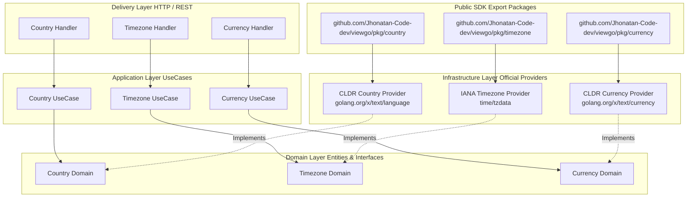

# ViewGo 🌍⚡

[](https://pkg.go.dev/github.com/Jhonatan-Code-dev/viewgo)
[](https://github.com/Jhonatan-Code-dev/viewgo/actions)
[](https://go.dev)
[](https://blog.cleancoder.com/uncle-bob/2012/08/13/the-clean-architecture.html)
[](https://opensource.org/licenses/MIT)

**ViewGo** is a production-grade, high-performance Go SDK and microservice published on **[pkg.go.dev](https://pkg.go.dev/github.com/Jhonatan-Code-dev/viewgo)**. 

Built with **Clean Architecture** principles inside a **Modular Monolith** pattern, it provides dynamic, official reference data for **Countries**, **IANA Timezones**, and **ISO 4217 Currencies & Symbols** without any hardcoded static datasets.

---

## 📦 How to Import as a Go Library

Install ViewGo into your Go project:

```bash
go get github.com/Jhonatan-Code-dev/viewgo@latest
```

### 1. Country Package Example (`pkg/country`)
```go
package main

import (
	"context"
	"fmt"
	"log"

	"github.com/Jhonatan-Code-dev/viewgo/pkg/country"
)

func main() {
	provider, err := country.NewProvider()
	if err != nil {
		log.Fatal(err)
	}

	c, err := provider.GetCountryByCode(context.Background(), "CO")
	if err != nil {
		log.Fatal(err)
	}

	fmt.Printf("%s (%s / %s) - M.49: %d\n", c.Name, c.Alpha2, c.Alpha3, c.Numeric)
	// Output: Colombia (CO / COL) - M.49: 170
}
```

### 2. Timezone Package Example (`pkg/timezone`)
```go
package main

import (
	"context"
	"fmt"
	"log"

	"github.com/Jhonatan-Code-dev/viewgo/pkg/timezone"
)

func main() {
	provider, err := timezone.NewProvider()
	if err != nil {
		log.Fatal(err)
	}

	tz, err := provider.GetTimezoneByName(context.Background(), "America/Bogota")
	if err != nil {
		log.Fatal(err)
	}

	fmt.Printf("%s - Offset: %s (Current Time: %s)\n", tz.IANA, tz.UTCOffset, tz.CurrentTime)
	// Output: America/Bogota - Offset: -05:00
}
```

### 3. Currency Package Example (`pkg/currency`)
```go
package main

import (
	"context"
	"fmt"
	"log"

	"github.com/Jhonatan-Code-dev/viewgo/pkg/currency"
)

func main() {
	provider, err := currency.NewProvider()
	if err != nil {
		log.Fatal(err)
	}

	formatted, err := provider.FormatAmount(context.Background(), "EUR", 250.50)
	if err != nil {
		log.Fatal(err)
	}

	fmt.Println("Formatted Amount:", formatted)
	// Output: Formatted Amount: € 250.50
}
```

---

## 🌟 Key Features

- ❌ **Zero Static / Hardcoded Data**: All reference datasets are derived at runtime directly from official Go standard runtime packages (`time/tzdata`) and official Unicode CLDR repositories (`golang.org/x/text`).
- 🏗️ **Clean Architecture & Modular Monolith**: Strictly separated layers (`domain`, `application`, `infrastructure`, `delivery`) encapsulated in isolated modules (`country`, `timezone`, `currency`).
- 🌎 **ISO 3166-1 Country Registry**: Dynamic resolution of 285+ official countries and territories (Alpha-2, Alpha-3, UN M.49 numeric codes, English & native CLDR localized names).
- 🕒 **IANA Timezone Registry**: 123+ canonical IANA zones with dynamic UTC offsets, Daylight Saving Time (DST) status, and real-time localized timestamps.
- 💰 **ISO 4217 Currency & Symbol Engine**: 155+ legal tender currencies with official CLDR currency symbols (`$`, `€`, `¥`, `£`, `R$`, `zł`, `د.إ`), narrow symbols, and decimal precision formatting.
- 🚀 **Built-in REST API**: Ready-to-use HTTP REST microservice with JSON endpoints.

---

## 📐 Architecture Diagram



---

## 📁 Repository Structure (Go Standard Project Layout)

```text
viewgo/
├── .agents/                          # AGY Workspace Customization & Architecture Rules
│   ├── AGENTS.md
│   ├── rules/
│   │   └── golang-clean-architecture.md
│   └── skills/
│       ├── golang-clean-architecture/
│       └── modular-monolith-go/
├── .github/
│   └── workflows/
│       └── ci.yml                    # Automated GitHub Actions & pkg.go.dev Indexing Pipeline
├── cmd/
│   └── viewgo/
│       └── main.go                   # Main REST Server & Dynamic Statistics Banner Executable
├── pkg/                              # Exported Public Go SDK Packages (pkg.go.dev)
│   ├── country/                      # Public Country Package (country.NewProvider)
│   ├── timezone/                     # Public Timezone Package (timezone.NewProvider)
│   └── currency/                     # Public Currency Package (currency.NewProvider)
├── internal/
│   ├── shared/
│   │   └── domain/errors.go          # Shared Kernel Primitives & Sentinel Errors
│   └── modules/
│       ├── country/                  # Country Feature Module (Clean Architecture)
│       ├── timezone/                 # Timezone Feature Module (Clean Architecture)
│       └── currency/                 # Currency Feature Module (Clean Architecture)
├── doc.go                            # Top-level GoDoc package documentation
├── go.mod                            # Go Module definition
├── LICENSE                           # MIT License
└── README.md
```

---

## 🏷️ Publishing New Versions to pkg.go.dev

To publish a release so it appears immediately on **[pkg.go.dev/github.com/Jhonatan-Code-dev/viewgo](https://pkg.go.dev/github.com/Jhonatan-Code-dev/viewgo)**:

1. **Tag a semantic version in git**:
   ```bash
   git tag v0.1.0
   git push origin v0.1.0
   ```

2. **Trigger Go Proxy Indexing**:
   ```bash
   curl https://proxy.golang.org/github.com/Jhonatan-Code-dev/viewgo/@v/v0.1.0.info
   ```
   Or visit `https://pkg.go.dev/github.com/Jhonatan-Code-dev/viewgo@v0.1.0` in your browser.

---

## 📄 License

This project is open-source software licensed under the [MIT License](LICENSE).

Developed with ❤️ by [Jhonatan-Code-dev](https://github.com/Jhonatan-Code-dev).
