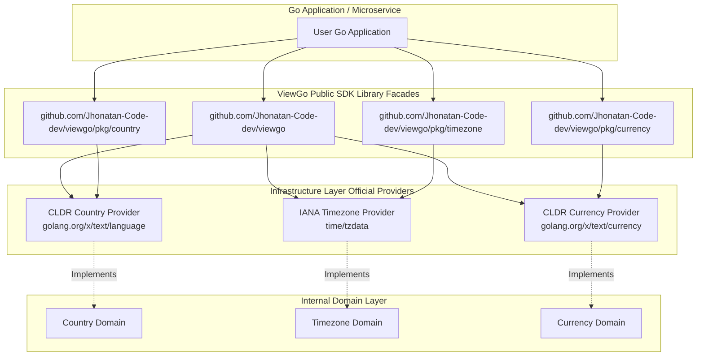

# ViewGo

[](https://pkg.go.dev/github.com/Jhonatan-Code-dev/viewgo)
[](https://github.com/Jhonatan-Code-dev/viewgo/actions)
[](https://go.dev)
[](https://blog.cleancoder.com/uncle-bob/2012/08/13/the-clean-architecture.html)
[](https://opensource.org/licenses/MIT)

ViewGo is a high-performance Go SDK library module published on [pkg.go.dev](https://pkg.go.dev/github.com/Jhonatan-Code-dev/viewgo).

Designed according to Clean Architecture principles embedded within a Modular Monolith layout, ViewGo provides in-memory, dynamic reference data for **Countries** (ISO 3166-1), **IANA Timezones**, and **ISO 4217 Currencies & Symbols** without hardcoded static datasets or external network HTTP dependencies.

---

## Installation & Import

Install ViewGo in your Go project:

```bash
go get github.com/Jhonatan-Code-dev/viewgo@latest
```

---

## Code Examples

### 1. Unified Top-Level Package Usage (`viewgo`)

```go
package main

import (
	"context"
	"fmt"
	"log"

	"github.com/Jhonatan-Code-dev/viewgo"
)

func main() {
	ctx := context.Background()

	// Initialize dynamic providers
	countryProvider, err := viewgo.NewCountryProvider()
	if err != nil {
		log.Fatal(err)
	}

	tzProvider, err := viewgo.NewTimezoneProvider()
	if err != nil {
		log.Fatal(err)
	}

	currProvider, err := viewgo.NewCurrencyProvider()
	if err != nil {
		log.Fatal(err)
	}

	// 1. Country Query
	colombia, _ := countryProvider.GetCountryByCode(ctx, "CO")
	fmt.Printf("Country: %s (%s / %s) - M.49: %d\n", colombia.Name, colombia.Alpha2, colombia.Alpha3, colombia.Numeric)

	// 2. Timezone Query
	bogota, _ := tzProvider.GetTimezoneByName(ctx, "America/Bogota")
	fmt.Printf("Timezone: %s - Offset: %s\n", bogota.IANA, bogota.UTCOffset)

	// 3. Currency Formatting
	formattedEUR, _ := currProvider.FormatAmount(ctx, "EUR", 250.50)
	fmt.Printf("Formatted Currency: %s\n", formattedEUR)
}
```

---

### 2. Standalone Subpackage Usage (`pkg/country`, `pkg/timezone`, `pkg/currency`)

#### Country Subpackage (`pkg/country`)
```go
import (
	"context"
	"fmt"

	"github.com/Jhonatan-Code-dev/viewgo/pkg/country"
)

func main() {
	provider, _ := country.NewProvider()
	c, _ := provider.GetCountryByCode(context.Background(), "ES")
	fmt.Printf("%s (%s / %s)\n", c.Name, c.Alpha2, c.Alpha3)
}
```

#### Timezone Subpackage (`pkg/timezone`)
```go
import (
	"context"
	"fmt"

	"github.com/Jhonatan-Code-dev/viewgo/pkg/timezone"
)

func main() {
	provider, _ := timezone.NewProvider()
	tz, _ := provider.GetTimezoneByName(context.Background(), "Europe/London")
	fmt.Printf("%s (%s)\n", tz.IANA, tz.UTCOffset)
}
```

#### Currency Subpackage (`pkg/currency`)
```go
import (
	"context"
	"fmt"

	"github.com/Jhonatan-Code-dev/viewgo/pkg/currency"
)

func main() {
	provider, _ := currency.NewProvider()
	formatted, _ := provider.FormatAmount(context.Background(), "USD", 1500.75)
	fmt.Println(formatted) // $ 1500.75
}
```

---

## Core Capabilities

- **Pure Go Library**: Zero HTTP server overhead. Directly embeds into your Go microservices or monoliths.
- **Zero Static Datasets**: All reference data is dynamically resolved at runtime from standard Go libraries (`time/tzdata`) and official Unicode CLDR registries (`golang.org/x/text`).
- **ISO 3166-1 Country Registry**: Dynamic lookup of 285+ countries and territories including ISO Alpha-2, Alpha-3, UN M.49 numeric codes, English and localized native names.
- **IANA Timezone Registry**: Resolution of 123+ canonical IANA timezone identifiers with dynamic UTC offset calculation, DST status detection, and real-time localized timestamps.
- **ISO 4217 Currency Engine**: Resolution of 155+ legal tender currencies with official CLDR symbols, narrow symbols, and decimal precision formatting.

---

## Architecture Diagram



---

## Directory Layout

```text
viewgo/
├── .agents/                          # AGY Workspace Customization & Architecture Rules
├── .github/
│   └── workflows/
│       └── ci.yml                    # Automated GitHub Actions & pkg.go.dev Indexing Pipeline
├── cmd/
│   └── viewgo/
│       └── main.go                   # Interactive CLI Demonstration Executable
├── pkg/                              # Exported Public Go Subpackages
│   ├── country/                      # Public Country Package (country.NewProvider)
│   ├── timezone/                     # Public Timezone Package (timezone.NewProvider)
│   └── currency/                     # Public Currency Package (currency.NewProvider)
├── internal/
│   ├── shared/
│   │   └── domain/errors.go          # Shared Kernel Primitives & Sentinel Errors
│   └── modules/
│       ├── country/                  # Country Feature Module (Domain & Infrastructure)
│       ├── timezone/                 # Timezone Feature Module (Domain & Infrastructure)
│       └── currency/                 # Currency Feature Module (Domain & Infrastructure)
├── doc.go                            # Top-level GoDoc package documentation
├── example_test.go                   # Runnable GoDoc Examples
├── go.mod                            # Go Module definition
├── viewgo.go                         # Unified top-level package facade
├── LICENSE                           # MIT License
└── README.md
```

---

## License

This project is licensed under the [MIT License](LICENSE).
Copyright (c) 2026 Jhonatan-Code-dev.
